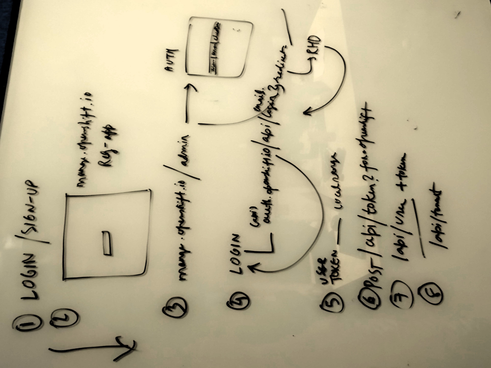

# Flow of login in OSIO

* LOGIN/SIGN-UP

* manage.openshift.io is a registration app. You request for OpenShift Online resources and you also get the OSIO access.

* manage.openshift.io/admin folks with admin rights go there and approve the users which makes the call to auth with information like username, cluster and email

* When the user is approved then the email goes out to notify the user about the approval

* LOGIN auth.openshift.io/api/login?redirect=... which goes to RHD and back to auth and back to you

* A USER TOKEN is available in the browser local storage, now

* POST /api/token?for=openshift I need to connect my OpenShift account

* GET /api/user + token returns the user details, gets the id from the token and then queries the database

* As a part of this it makes a call to /api/tenant 

See as it was captured while explaining it in the image below:

