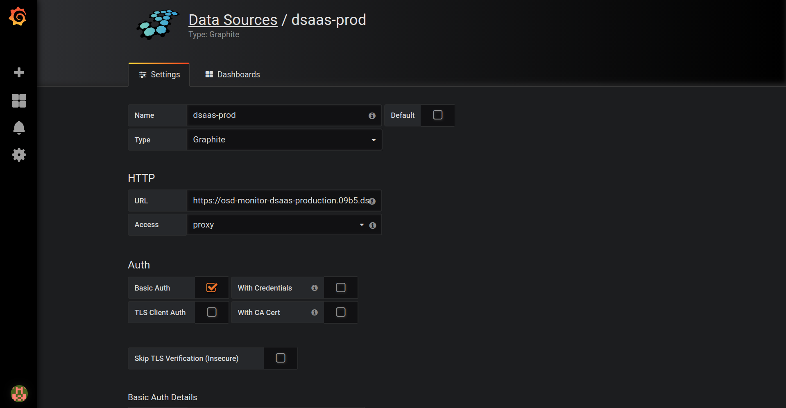
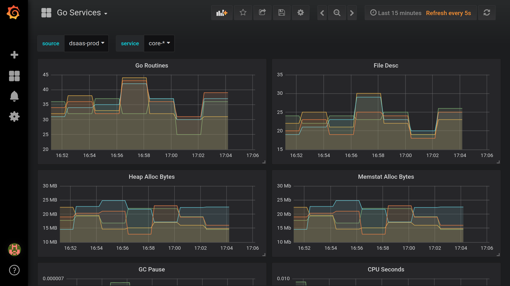

# Setting up Grafana to monitor production

### Bring up grafana locally

```bash
docker run -d -p 3000:3000 \
    -v /var/lib/grafana:/var/lib/grafana:Z \
    -e "GF_SECURITY_ADMIN_PASSWORD=secret" \
    grafana/grafana
```

### Access the dashboard

Now goto [http://localhost:3000](http://localhost:3000) and login using following credentials:

**username**: *admin* & **password**: *secret*.

### Add the data source

- Type: graphite
- URL: https://osd-monitor-dsaas-production.09b5.dsaas.openshiftapps.com//graphite
- Access: proxy
- Tick Basic Auth
- Basic Auth Details - User: (********)
- Basic Auth Details - Password: (Get that personally by contacting @aslak, @surajd, @xcoulon on Mattermost)

The setup should look similar to the one shown in the image below:



### Import dashboards

Once you successfully add the data source, now add dashboards by importing files: [go-services.json](dashboards/go-services.json) and [postgres.json](dashboards/postgres.json).

After importing them your dashboards would look like this:



Happy monitoring!
